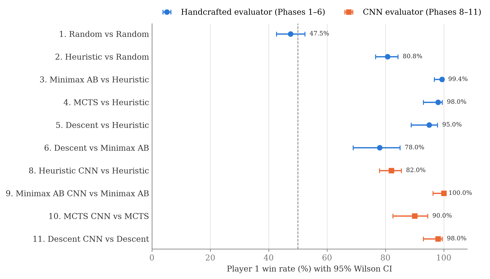
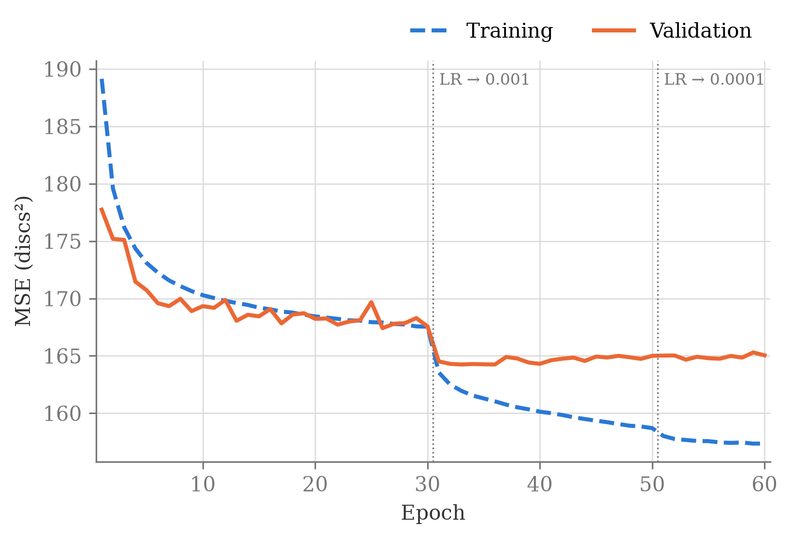
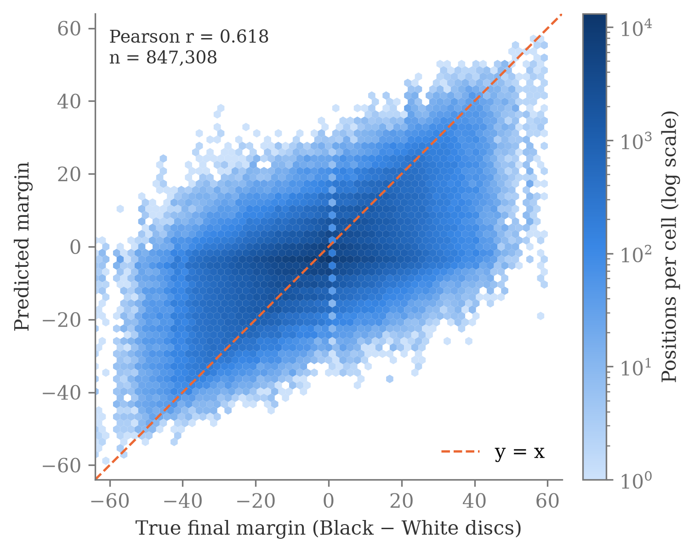

# Beyond Minimax: Tree Search and a CNN Evaluator for Othello

Code, trained models and benchmark results for my MSc thesis in Management Engineering (Università di Bologna, October 2026):

> **Beyond Minimax: Advanced Tree Search Algorithms and Machine Learning for Sequential Decision-Making — From Games to Supply Chain Applications**
> Giacomo Sacchet · Supervisor: Prof. Andrea Borghesi (Università di Bologna) · Co-supervisor: Prof. Lilian Buzer (ESIEE Paris)

The thesis builds a search-and-evaluate methodology on three board games of increasing complexity (Tic-Tac-Toe, Connect 4, Othello), then asks which parts of it transfer to a supply-chain problem, the Beer Game, formalized as a Markov Decision Process.

This repository contains the **experimental part**: four search algorithms (Minimax, Alpha-Beta, Monte Carlo Tree Search, and Descent Minimax, from Cohen-Solal & Cazenave's Athénan framework), a residual CNN trained on real Othello games, and a statistical benchmark of every combination. The Beer Game analysis is theoretical and is covered only in the thesis text.

## Key results

**A static, pretrained CNN evaluator improves every search algorithm tested.** Swapping the handcrafted heuristic for the CNN, with the search logic unchanged, gives a one-sided win-rate improvement in all four paradigms. Every 95% Wilson confidence interval lies well above 50%.

| CNN variant vs. heuristic variant | Games | P1 win rate | 95% CI |
|---|---:|---:|---|
| Minimax-AB + CNN vs Minimax-AB | 100 | **100.0%** | [96.3, 100.0] |
| Descent + CNN vs Descent | 100 | **98.0%** | [93.0, 99.4] |
| MCTS + CNN vs MCTS (CNN replaces the rollout) | 100 | **90.0%** | [82.6, 94.5] |
| Heuristic + CNN vs Heuristic (one-ply greedy) | 400 | **82.0%** | [77.9, 85.5] |

The uplift is largest when the network evaluates the leaves of a deterministic tree search, and smallest when it only guides a one-ply choice.



Other findings:
- **Algorithm hierarchy** under the same heuristic: Random ≪ Heuristic ≪ {Minimax-AB, MCTS, Descent}, each of the three searchers winning 95–99% against the Heuristic player.
- **Descent vs Minimax-AB**: Descent wins 78.0% head-to-head (CI [68.9, 85.0]). A post-hoc colour analysis shows the advantage is concentrated in the games where Descent plays White.
- **Colour effect**: across the suite there is a small but significant advantage for the second mover (White). Pooled Mantel-Haenszel OR = 0.65, CMH p < 0.001.

Full results, methodology and limitations are in Chapters 10–11 and 15 of the thesis.

## The CNN evaluator

`OthelloCNN` is a residual network (stem + 4 residual blocks + regression head, 300,481 parameters) with **no pooling**, so the 8×8 board keeps its spatial resolution throughout. It predicts the final disc margin from any mid-game position.

- **Input**: a 3×8×8 tensor (black discs, white discs, side to move)
- **Data**: about 85,000 games from the WTHOR database of the French Othello Federation, i.e. 4.2 M positions after move 10. The train/validation split (80/20) is done **by game**, not by position, so near-duplicate positions of the same game never end up on both sides.
- **Training**: 60 epochs, SGD with momentum, learning-rate drops at epochs 30 and 50, dihedral augmentation (8 symmetries), gradient clipping
- **Validation**: MAE 9.69 discs, Pearson r = 0.618, R² = 0.380, sign accuracy 73.3%

The network is a **drop-in replacement** for the handcrafted evaluation function: same signature, same sign convention. Each search algorithm therefore picks the evaluator at construction time without any change to its search logic.

<p>
  
  
</p>

## Repository structure

```
├── scripts/
│   ├── 01_tictactoe.py                  Minimax on Tic-Tac-Toe (Tkinter GUI)
│   ├── 02_connect4.py                   Depth-limited search + heuristic on Connect 4
│   ├── 03_tinycnn_sport.py              CNN image classifier (deep-learning warm-up)   [Colab]
│   ├── 04a–c_transfer_learning_*.py     Transfer learning, 3 phases (TensorFlow)       [Colab]
│   ├── 05_othello_cnn.py                OthelloCNN training on WTHOR                   [Colab]
│   ├── 06_othello.py                    Othello: 6 strategies × {heuristic, CNN}, GUI, benchmark suite
│   ├── plot_training.py                 CNN training figures
│   └── analyze_benchmark.py             Post-hoc statistics (draws, colour effects, Wilson CIs)
├── models/
│   ├── othello_cnn_v2.pth               Final model, used for all results in the thesis
│   └── othello_cnn.pth                  Earlier model (see "Model versions")
└── results/
    ├── cnn_training/                    Training log, validation predictions, figures A–E
    └── benchmark/                       Raw benchmark reports and analysis outputs
```

## Running the code

Requires Python 3 with Tkinter (for the GUIs).

```bash
git clone https://github.com/<giacomo-sacchet>/game-tree-search-cnn.git
cd game-tree-search-cnn
python3 -m venv .venv && source .venv/bin/activate
pip install -r requirements.txt
```

**Play Othello or run the benchmark**

```bash
python scripts/06_othello.py
```

The script offers three modes:
1. **Play vs AI**: play against any of the 12 configurations. Keys `1`–`6` select Random, Heuristic, Minimax, Minimax-AB, MCTS and Descent; `1c`–`6c` select the same strategies with the CNN evaluator.
2. **Simulation**: AI vs AI over N games.
3. **Complete Test**: the full benchmark suite. It takes several hours and overwrites `results/benchmark/othello_benchmark_results_cnn_v2.txt`.

If PyTorch or the model file is missing, the CNN variants silently fall back to the heuristic.

**Regenerate figures and statistics from the saved results** (no games are replayed):

```bash
python scripts/plot_training.py
python scripts/analyze_benchmark.py
```

**Colab scripts** (`03`, `04a–c`, `05`) were run on Google Colab with a GPU and expect the datasets on a mounted Google Drive. They are included for completeness and are not runnable locally as they are. `04a–c` use TensorFlow; everything else uses PyTorch. The WTHOR game files are freely available from the [French Othello Federation](https://www.ffothello.org/informatique/la-base-wthor/) and are not redistributed here.

## Model versions and benchmark reports

The benchmark was run in two sessions with the same harness and settings:

- `othello_benchmark_results.txt` contains the original run of the full suite. **Phases 1–6** (no CNN) in the thesis come from this file.
- `othello_benchmark_results_cnn_v2.txt` contains **Phases 8–11**, re-run after the CNN was retrained with the final protocol (game-level split, gradient clipping) as `othello_cnn_v2.pth`.

`analyze_benchmark.py` reads both reports by default and takes each phase from the right one. The earlier model `othello_cnn.pth`, and its CNN phases in the first report, are kept for reference only. Phase numbering follows the thesis.

## Thesis

The full thesis is available in [`docs/`](docs/).

## References

- Q. Cohen-Solal, T. Cazenave. *Minimax Strikes Back*. AAMAS 2023.
- Q. Cohen-Solal. *Learning to Play Two-Player Perfect-Information Games without Knowledge*. arXiv:2008.01188.
- D. Silver et al. *A General Reinforcement Learning Algorithm that Masters Chess, Shogi, and Go through Self-Play*. Science, 2018.
- K. He et al. *Deep Residual Learning for Image Recognition*. CVPR 2016.
- L. Kocsis, C. Szepesvári. *Bandit Based Monte-Carlo Planning*. ECML 2006.
- E. B. Wilson. *Probable Inference, the Law of Succession, and Statistical Inference*. JASA, 1927.

## License

MIT, see [LICENSE](LICENSE).
